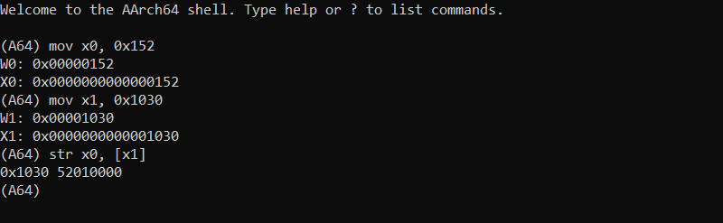
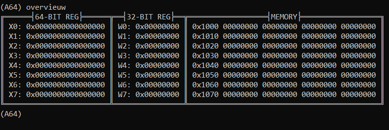
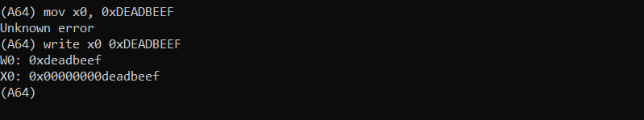
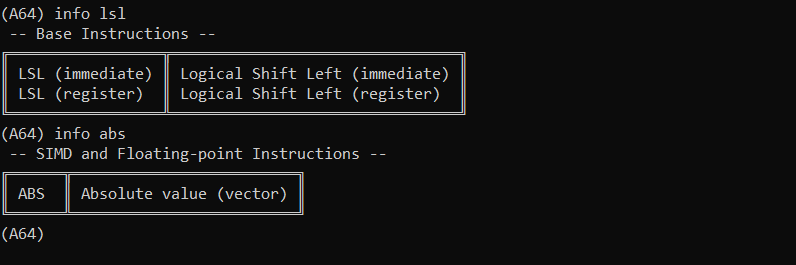

# Armv8-A A64 Shell
A cross-platform interactive shell to try out A64 instructions and watch the changes in registers and memory.

  

## Commands
With `overview` a quick overview is shown of common registers and the mapped memory.  

  

You can also directly write to registers and memory by using the `write` command. This can help overcome the limitations of the MOV instruction far example.  

  

The `info` command gives a short description of a given instruction.  

  

## How does it work?
The assembling is handled by [Keystone](https://www.keystone-engine.org/) and the emulation by [Unicorn](https://www.unicorn-engine.org/).  
Information about the instructions has been scraped from the [Armv8-A ISA](https://developer.arm.com/docs/ddi0596/i).  
To keep execution straightforward a single instruction is written to the base address and is executed. This means branching is out of the question, directives are also not supported.  

